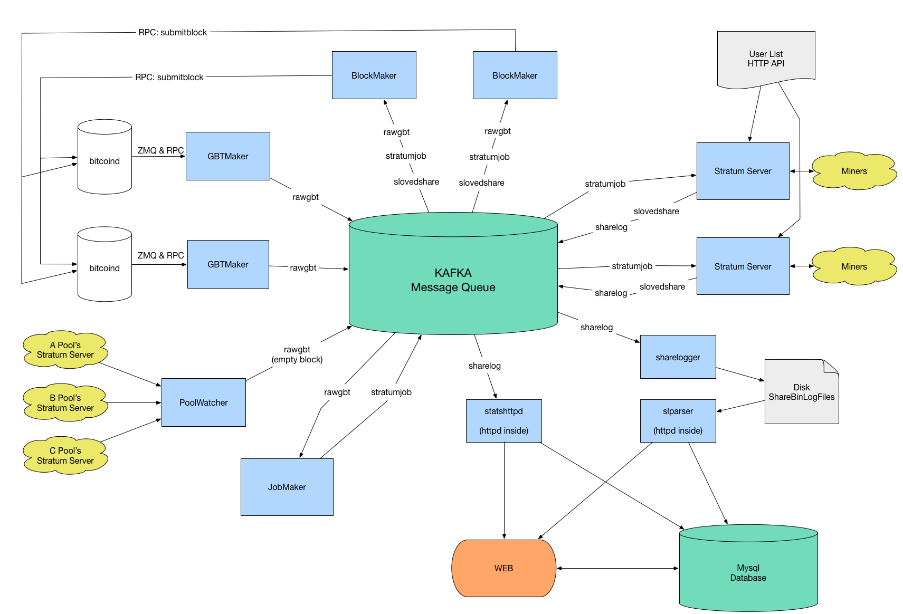

McAfee Pool
==================

McAfeePool is the backend system for John McAfee's bitcoin mining pool, set to launch in March.

It is a fork of the backend for:[https://pool.btc.com](https://github.com/btccom/btcpool).
Forked Feb 2, 2017

WARNING!
This is a work in progress, anything is subject to change at anytime.

Until the pool is formally launched, this code should be assumed to be not ready for production!

## Architecture

## How To Install

1. Install `Zookeeper`, or see [INSTALL-ZooKeeper.md](https://github.com/mpatc/McAfeePool/blob/master/docs/INSTALL-ZooKeeper.md)
  * [https://zookeeper.apache.org/](https://zookeeper.apache.org/)
2. Install `Kafka`, or see [INSTALL-Kafka.md](https://github.com/mpatc/McAfeePool/blob/master/docs/INSTALL-Kafka.md)
  * [https://kafka.apache.org/](https://kafka.apache.org/)
3. Install `Bitcoind`, need to enable ZMQ
4. Install `McAfeePool`, see [INSTALL.md](https://github.com/mpatc/McAfeePool/blob/master/INSTALL.md)

## Benchmark

btccom pool has tested 100,000 miners online simultaneously as a Benchmark. see [Benchmark-100000.md](https://github.com/mpatc/McAfeePool/blob/master/docs/Benchmark-100000.md)

## BtcAgent

BtcAgent is a type of stratum proxy which uses a customized protocol to communicate with the pool. It's efficient and designed for huge mining farms.

* [AGENT.md](https://github.com/mpatc/McAfeePool/blob/master/docs/AGENT.md)
* BtcAgent's [HomePage](https://github.com/btccom/btcagent)

## Testing

You can run `simulator` to test the system. It will simulate a lots of miners, but first you need to enbale config `enable_simulator` on your Stratum Server.

## License
McAfeePool is released under the terms of the MIT license. See [LICENSE](LICENSE) for more information or see [https://opensource.org/licenses/MIT](https://opensource.org/licenses/MIT).

Welcome aboard!

www.mgtci.com Team.
